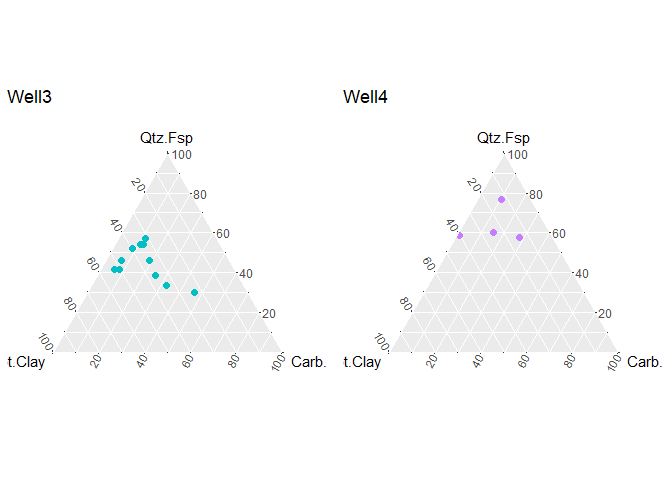

## Duvernay Mineralogy
In some areas it is postulated [link](https://geoconvention.com/wp-content/uploads/abstracts/2019/GC2019_149_Mineralogical_controls_on_organic-hosted_pore_volume_and_pore_size-1.pdf) that higher Quartz & Feldspar content in the Duvernay leads to enhanced organic hosted porosity and permeability and thus increased production.  The following ternary plots compare the composition of the new well to known Duvernay producers in the area to make a prediction about production potential of the new well.

Well locations have been anonymized for confidentiality.

### Assumptions
1. High Quartz and Feldspar mineralogy is correlated to high porosity and permeability
2. High porosity is correlated to higher production


<span style="color:red">**ADD SECTION ON WHERE THE DATA CAME FROM**</span>


```r
wells <- read.csv("./AllWells.csv")
library(dplyr)
library(ggtern)
```

## Normalizing Data


```r
normal <- wells %>% mutate(nQtz.Fsp = round(QUARTZ.FSP/(QUARTZ.FSP + CARBONATE + TOTALCLAY)*100, 1), 
                           nCarb = round(CARBONATE/(QUARTZ.FSP + CARBONATE + TOTALCLAY)*100, 1),
                           nClay = round(TOTALCLAY/(QUARTZ.FSP + CARBONATE + TOTALCLAY)*100, 1))
```

## Individual Wells
Create ternary plots of Quartz.Feldspar vs Carbonate vs TotalClay content of new well and of successful Duvernay wells in the asset area.

```r
## Well1
Well1 <- filter(normal, Name == "Well1")
PlotWell1 <- ggtern(data = Well1, aes(nClay, nQtz.Fsp, nCarb)) + 
  geom_point(size = 2, color = "#999933") + ggtitle("Well1") +
  Tlab("Qtz.Fsp") + Llab("Tot.Clay") + Rlab("Carb.")


## Well2
Well2 <- filter(normal, Name == "Well2")
PlotWell2 <- ggtern(data = Well2, aes(nClay, nQtz.Fsp, nCarb)) + 
  geom_point(size = 2, color = "#33FF99") + ggtitle("Well2") +
  Tlab("Qtz.Fsp") + Llab("Tot.Clay") + Rlab("Carb.")


## Well3
Well3 <- filter(normal, Name == "Well3")
PlotWell3 <- ggtern(data = Well3, aes(nClay, nQtz.Fsp, nCarb)) + 
  geom_point(size = 2, color = "#00BFC4") + ggtitle("Well3") +
  Tlab("Qtz.Fsp") + Llab("Tot.Clay") + Rlab("Carb.")


## New Well  "#F8766D"
NewWell <- filter(normal, Name == "NewWell")
PlotNewWell <- ggtern(data = NewWell, aes(nClay, nQtz.Fsp, nCarb)) + 
  geom_point(size = 2, color = "#F8766D") + ggtitle("NewWell") +
  Tlab("Qtz.Fsp") + Llab("Tot.Clay") + Rlab("Carb.")


## Well4
Well4 <- filter(normal, Name == "Well4")
PlotWell4 <- ggtern(data = Well4, aes(nClay, nQtz.Fsp, nCarb)) + 
  geom_point(size = 2, color = "#C77CFF") + ggtitle("Well4") +
  Tlab("Qtz.Fsp") + Llab("Tot.Clay") + Rlab("Carb.")


grid.arrange(PlotWell1, PlotWell2, ncol =2)
```

<!-- -->

```r
grid.arrange( PlotWell3, PlotWell4,ncol =2)
```

<!-- -->

```r
PlotNewWell
```

<!-- -->

## All wells
Create a single ternary plot of successful Duvernay wells in the area along with the new well in order to directly compare Duvernay mineralogy. It appears that the New Well has similar mineralogy to successful wells in the area and it can be predicted that IF mineralogy plays an important role in porosity and hence production that the New Well has a good chance of success.


```r
PlotAllWells <- ggtern(data = normal, aes(nClay, nQtz.Fsp, nCarb)) + geom_point(aes(color = Name), size = 2) + ggtitle("All Wells") + Tlab("Qtz.Fsp") + Llab("Tot.Clay") + Rlab("Carb.")
PlotAllWells
```

<!-- -->

<span style="color:red">**FUTURE WORK**</span>
Create a correlation matrix between the known producers and the new well.  Try and determine correlation between ultimate recovery and mineralogy. Also compare ultimate recovery with other variables (porosity, wellbore design, natural fractures, completions design).


